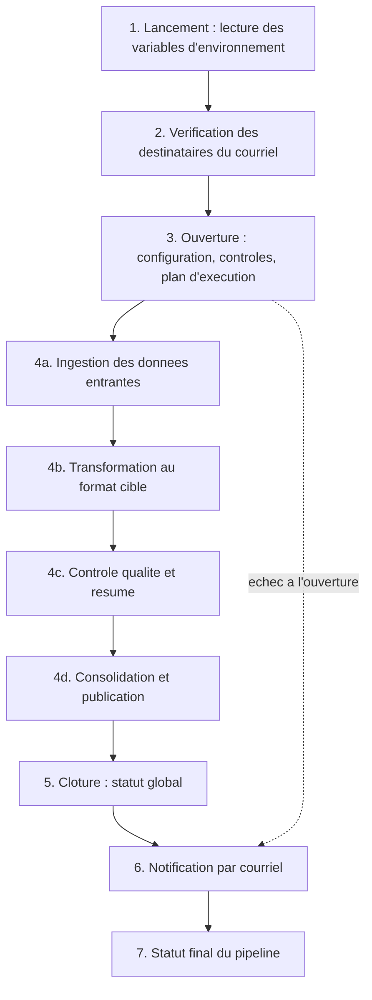

# Hub RH TalentSoft → ADP sur Microsoft Fabric — vue d'ensemble

Ce dossier contient la version Fabric du hub d'intégration RH de Motul. Chaque jour, le hub récupère les données
des salariés et de rémunération exportées par **TalentSoft**, les met au format attendu par la paie **ADP**, contrôle
leur qualité, les conserve dans un Lakehouse, puis les met à disposition et informe une liste de diffusion.

Ce document décrit le fonctionnement **dans les grandes lignes**. Chaque étape renvoie vers sa description détaillée
dans [README_DETAIL.md](README_DETAIL.md).

## Les objets Fabric

| Objet | Rôle en une phrase |
|---|---|
| `MOTUL_PL_HRIS_Orchestrateur` | Le pipeline : il lance les traitements dans le bon ordre, une fois par jour à 03:00. |
| `MOTUL_nb_hris_lib` | La boîte à outils commune, utilisée par tous les notebooks ; elle n'est jamais lancée seule. |
| `MOTUL_nb_hris_ingest` | Récupère les données entrantes : export TalentSoft, fichiers SFTP, référentiels, imports ponctuels. |
| `MOTUL_nb_hris_transform` | Calcule ce qui a changé depuis la veille et le met au format paie. |
| `MOTUL_nb_hris_control` | Ouvre l'exécution, contrôle la qualité, produit les résumés, puis clôture l'exécution. |
| `MOTUL_nb_hris_publish` | Consolide les données validées et les publie selon l'environnement. |
| `MOTUL_nb_hris_notify` | Envoie le courriel de bilan ou d'erreur à la liste de diffusion. |
| `MOTUL_LH_HRIS` | Le Lakehouse : toutes les tables de données, de configuration et de suivi. |

Les mêmes objets existent à l'identique dans les trois workspaces DEV, UAT et PRD. Seules les valeurs de la
bibliothèque de variables `VL_HRIS` changent d'un environnement à l'autre. [→ Détail](README_DETAIL.md#environnements)

## Le déroulement d'une exécution

1. **Lancement.** Le pipeline est prévu pour démarrer chaque jour à 03:00, et peut être lancé à la demande. Il lit une seule fois les variables
   de l'environnement courant (adresses, chemins, noms de secrets) et fixe l'identifiant et la date du traitement.
   [→ Détail](README_DETAIL.md#etape-1)
2. **Vérification des destinataires.** Avant tout traitement, le hub vérifie qu'il saura à qui envoyer le bilan,
   pour qu'un échec, même précoce, soit toujours signalé. [→ Détail](README_DETAIL.md#etape-2)
3. **Ouverture.** Le notebook de contrôle prépare l'exécution. Il applique la configuration de référence, vérifie
   que rien ne manque, puis calcule le plan : quels flux lancer, dans quel ordre et lesquels en parallèle. Les flux
   déjà réussis pour la même date ne sont pas relancés. [→ Détail](README_DETAIL.md#etape-3)
4. **Traitement par vagues.** Le plan est exécuté vague par vague ; dans une vague, les flux indépendants tournent
   en parallèle. Un flux en échec n'arrête pas les autres : seuls les flux qui dépendent de lui sont bloqués.
   [→ Détail](README_DETAIL.md#etape-4)
   - **4a. Ingestion** — les données entrantes sont chargées telles quelles dans le Lakehouse.
     [→ Détail](README_DETAIL.md#etape-4a)
   - **4b. Transformation** — le hub compare les données du jour à celles de la veille, ne garde que ce qui a
     changé, applique les correspondances TalentSoft → ADP et écarte les lignes non conformes avec leur motif.
     [→ Détail](README_DETAIL.md#etape-4b)
   - **4c. Contrôle** — le hub compte les lignes lues, retenues et rejetées, et trace chaque règle de qualité.
     [→ Détail](README_DETAIL.md#etape-4c)
   - **4d. Consolidation et publication** — le lot validé enrichit une table cumulative et remplace le contenu de
     la table finale, qui sert ensuite de source à la publication : vers les systèmes externes en PRD uniquement,
     dans le Lakehouse local en DEV et en UAT. [→ Détail](README_DETAIL.md#etape-4d)
5. **Clôture.** Le hub calcule le statut global de l'exécution : Succès, Succès avec rejets, Échec partiel ou
   Échec. [→ Détail](README_DETAIL.md#etape-5)
6. **Notification.** Un courriel HTML est envoyé à la liste de diffusion : un bilan chiffré en cas de succès, le
   diagnostic réel en cas d'échec, sans aucune donnée personnelle. [→ Détail](README_DETAIL.md#etape-6)
7. **Statut final.** Si l'exécution n'est pas un succès, le pipeline se termine en échec pour déclencher l'alerte
   technique de Fabric. [→ Détail](README_DETAIL.md#etape-7)

## Les règles à retenir

- **Aucune publication externe hors PRD.** DEV et UAT n'envoient rien à ADP ni au SFTP de TalentSoft : leur
  résultat reste dans leur propre Lakehouse. [→ Détail](README_DETAIL.md#garde-fous)
- **Aucune valeur d'environnement dans le code.** Tout ce qui diffère entre DEV, UAT et PRD vient de `VL_HRIS` ou du
  coffre de secrets de l'environnement. Une variable manquante arrête l'exécution, sans valeur par défaut.
  [→ Détail](README_DETAIL.md#variables)
- **Rien n'est fait deux fois.** Relancer une exécution ne crée pas de doublon, ne republie pas un fichier déjà
  déposé et ne renvoie pas un courriel déjà envoyé. [→ Détail](README_DETAIL.md#reprise)
- **Tout est tracé.** Chaque étape de chaque flux laisse une ligne avec son statut, ses volumes et son diagnostic
  dans la table `ctl_execution_etape`. [→ Détail](README_DETAIL.md#suivi)

## Pour aller plus loin

- [Les tables du Lakehouse](README_DETAIL.md#tables)
- [Relancer ou reprendre une exécution](README_DETAIL.md#reprise)
- [Diagnostiquer un échec](README_DETAIL.md#suivi)
- [Les fichiers encore utilisés](README_DETAIL.md#fichiers)
- [Les points qui restent à confirmer](README_DETAIL.md#a-confirmer)
