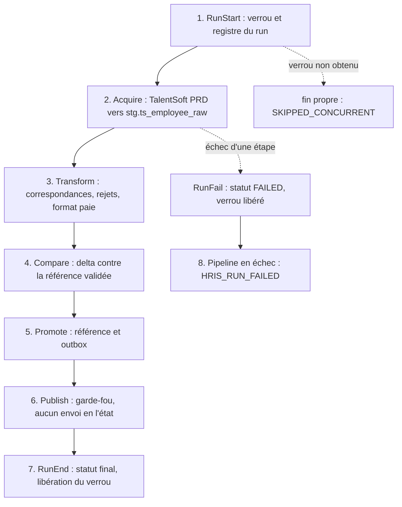

# Hub RH TalentSoft PRD → Lakehouse (puis ADP) sur Microsoft Fabric — vue d'ensemble

Ce dossier contient la deuxième version Fabric du hub d'intégration RH de Motul. À chaque exécution, le hub extrait
les données des salariés depuis **TalentSoft PRD**, applique les règles de transformation de l'existant (Synapse),
contrôle leur qualité, compare le résultat à l'état validé précédent, le conserve dans un Lakehouse et prépare ce qui
devra être publié vers la paie **ADP**. La publication vers ADP est **verrouillée** : elle n'est ni activée ni exécutée
dans cette version.

Ce document décrit le fonctionnement **dans les grandes lignes** et propose un **plan de présentation d'une heure**.
Chaque étape renvoie vers sa description détaillée dans [README_DETAILS.md](README_DETAILS.md).

## État d'avancement en un coup d'œil

| Niveau | État | Preuve |
|---|---|---|
| Code écrit et testé localement | **Fait** : 68 tests unitaires, 2 scénarios de non-régression contre la Function ADP d'origine, parité Spark | rapports de test |
| Objets créés dans le workspace non-PRD | **Fait** : 10 notebooks, 1 variable library, 1 pipeline, tables du Lakehouse | 12 items du workspace |
| Tests dans Fabric sur données fictives | **Fait** : 71 tests, 0 échec, **sans Lakehouse par défaut** | campagne 3 |
| Pipeline exécutable en manuel | **Fait** : 4 runs ; démarrage, enchaînement et gestion d'échec validés | historique des runs |
| **Extraction réelle TalentSoft PRD** | **Bloquée** : les secrets sont dans un coffre d'un autre tenant (`AKV10032 Invalid issuer`) | pré-contrôle tracé dans `ctl.run_step` |
| Transformation, comparaison, référence sur données réelles | **Non réalisés** (dépendent de l'extraction et des correspondances, vides) | — |
| Publication ADP | **Verrouillée dans le code** ; jamais exécutée ; contrat final absent | zéro opération ni tentative ADP |
| Synchronisation Git ↔ Fabric | **Fichiers préparés**, rien commité ni poussé | `git status` : uniquement des ajouts |

Ne pas confondre : *code écrit* ≠ *objet créé* ≠ *pipeline exécutable* ≠ *acquisition réelle* ≠ *traitement validé* ≠
*publication autorisée*. Seuls les trois premiers niveaux sont atteints.

## Plan de présentation (60 minutes)

| Durée | Sujet | À montrer | Détail |
|---|---|---|---|
| 0-5 min | Contexte, objectifs, ce qui change par rapport à l'existant | Schéma « avant / après » | [Contexte](README_DETAILS.md#contexte) |
| 5-12 min | Architecture et déroulement d'un run | Schéma du pipeline, liste des objets | [Architecture](README_DETAILS.md#architecture) |
| 12-22 min | Acquisition TalentSoft PRD | Règles d'extraction, contrôles de complétude, blocage des secrets | [Acquisition](README_DETAILS.md#acquisition) |
| 22-30 min | Transformation et qualité | Parité avec le SQL de production, rejets, empreinte | [Transformation](README_DETAILS.md#transformation) |
| 30-37 min | Comparaison, promotion, outbox | Catégories, premier chargement, idempotence | [Comparaison](README_DETAILS.md#comparaison) · [Promotion](README_DETAILS.md#promotion) |
| 37-45 min | Publication ADP et garde-fou | Arbre de décision, opérations, résultats incertains | [Publication](README_DETAILS.md#publication) |
| 45-52 min | Preuves et démonstration | Tests, sondes de plateforme, contrôle du Lakehouse | [Tests](README_DETAILS.md#tests) · [Démonstration](README_DETAILS.md#demo) |
| 52-57 min | Git, Fabric et exploitation | Format des items, relance manuelle, vérifications SQL | [Git](README_DETAILS.md#git) · [Exploitation](README_DETAILS.md#exploitation) |
| 57-60 min | Blocages, décisions, prochaines étapes | Tableau des actions | [Blocages](README_DETAILS.md#blocages) |

## Les objets Fabric

| Objet | Rôle en une phrase |
|---|---|
| `PL_HRIS_ORCHESTRATOR` | Le pipeline : enchaîne les étapes d'un run et gère les échecs ; lancement manuel, aucune planification. |
| `VL_HRIS` | Les paramètres de l'environnement (aucun secret) : source TalentSoft, référence du coffre, nom du Lakehouse… |
| `NB_HRIS_LIB` | La bibliothèque commune, embarquée à l'identique dans chaque notebook. |
| `NB_HRIS_SETUP` | Crée, de façon idempotente, les schémas et les 42 tables. |
| `NB_HRIS_RUN_CONTROL` | Ouvre un run (verrou, registre), le clôture ou le déclare en échec. |
| `NB_HRIS_TS_ACQUIRE` | Extrait les salariés de TalentSoft PRD vers le Lakehouse et contrôle la complétude. |
| `NB_HRIS_TRANSFORM` | Reprend les règles SQL de production : correspondances, rejets, format paie. |
| `NB_HRIS_COMPARE` | Compare le résultat à la référence du dernier run validé et décide `VALIDATED` ou `BLOCKED`. |
| `NB_HRIS_PROMOTE` | Met à jour la référence et prépare la liste des salariés à publier (outbox). |
| `NB_HRIS_PUBLISH_ADP` | Publication ADP : garde-fou sur le workspace d'exécution, activation verrouillée. |
| `NB_HRIS_TESTS` | Tests sur données fictives, dans un schéma isolé. |
| `MOTUL_LH_HRIS` | Le Lakehouse (dossier `TEST_1`) : toutes les tables de données, de contrôle et de log. |

Les mêmes objets, avec le même code, sont prévus pour tous les environnements ; seuls les paramètres de `VL_HRIS`
changeraient. Hors DEV, rien n'est déployé à ce jour. [→ Détail](README_DETAILS.md#architecture)

## Le déroulement d'un run

1. **Ouverture.** Le run reçoit l'identifiant du pipeline, une date métier (Paris) et un verrou : un seul run actif à
   la fois. [→ Détail](README_DETAILS.md#run-control)
2. **Acquisition.** Extraction complète des salariés de « Motul France » depuis TalentSoft PRD, avec contrôle que
   tout a bien été reçu. [→ Détail](README_DETAILS.md#acquisition)
3. **Transformation.** Les règles de l'existant sont reproduites ligne à ligne ; les salariés non conformes sont
   rejetés avec leur motif. [→ Détail](README_DETAILS.md#transformation)
4. **Comparaison.** Le résultat est comparé à l'état validé précédent : nouveaux, modifiés, inchangés, absents,
   rejetés. [→ Détail](README_DETAILS.md#comparaison)
5. **Promotion.** Si aucun contrôle bloquant n'échoue, la référence est mise à jour et la liste à publier est figée.
   [→ Détail](README_DETAILS.md#promotion)
6. **Publication.** Le notebook évalue si le workspace d'exécution l'autorise ; même alors, l'envoi réel reste
   verrouillé. [→ Détail](README_DETAILS.md#publication)
7. **Clôture.** Le statut final est calculé, le verrou libéré ; aucune notification n'est envoyée à ce stade.
   [→ Détail](README_DETAILS.md#run-control)
8. **Échec.** Un gestionnaire d'erreur unique déclare le run en échec, libère le verrou et termine le pipeline en
   erreur pour déclencher l'alerte technique de Fabric.

## Les règles à retenir

- **La source est toujours TalentSoft PRD**, même depuis un workspace non-PRD. Aucun repli vers un tenant de test ;
  les données fictives ne servent qu'aux tests isolés. [→ Détail](README_DETAILS.md#acquisition)
- **Aucune publication ADP réelle.** Le garde-fou lit le nom *réel* du workspace du notebook de publication ; l'envoi
  est en plus verrouillé dans le code tant que le contrat final n'est pas validé. [→ Détail](README_DETAILS.md#publication)
- **Aucun secret ni donnée RH en clair** dans le code, les paramètres, les journaux ou les rapports : compteurs,
  noms de colonnes et empreintes seulement. [→ Détail](README_DETAILS.md#securite)
- **Rien n'est fait deux fois.** Chaque écriture est idempotente ; un résultat incertain n'est jamais renvoyé
  automatiquement. [→ Détail](README_DETAILS.md#exploitation)
- **Aucun Lakehouse par défaut à attacher** : les tables sont adressées par leur nom complet
  (workspace, Lakehouse, schéma, table). [→ Détail](README_DETAILS.md#git)
- **Rien n'est supprimé ni écrasé** sans validation distincte. [→ Détail](README_DETAILS.md#exploitation)

## Pour aller plus loin

- [Contexte et vocabulaire](README_DETAILS.md#contexte)
- [Les 42 tables du Lakehouse](README_DETAILS.md#tables)
- [Tests et preuves](README_DETAILS.md#tests)
- [Intégration Git et Fabric](README_DETAILS.md#git)
- [Relancer et vérifier un run](README_DETAILS.md#exploitation)
- [Blocages, décisions et prochaines étapes](README_DETAILS.md#blocages)
- [Questions probables](README_DETAILS.md#faq)

*Dossiers de travail (hors dépôt Git) : `Migration_Fabric_Motul/TEST_2` (spécifications) et
`Migration_Fabric_Motul/TEST_2/implementation` (code source, tests, outils, rapports, procédures).*
