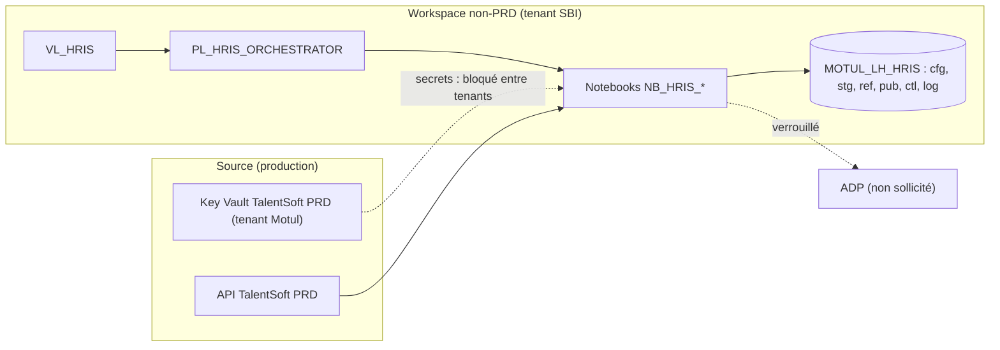
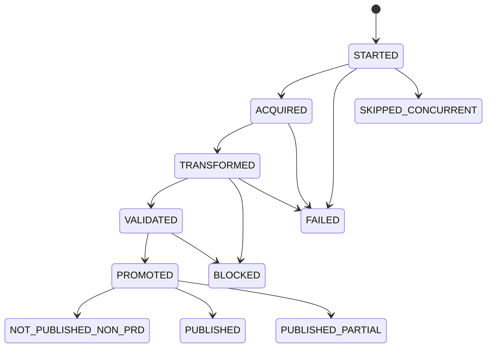
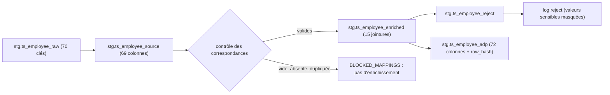
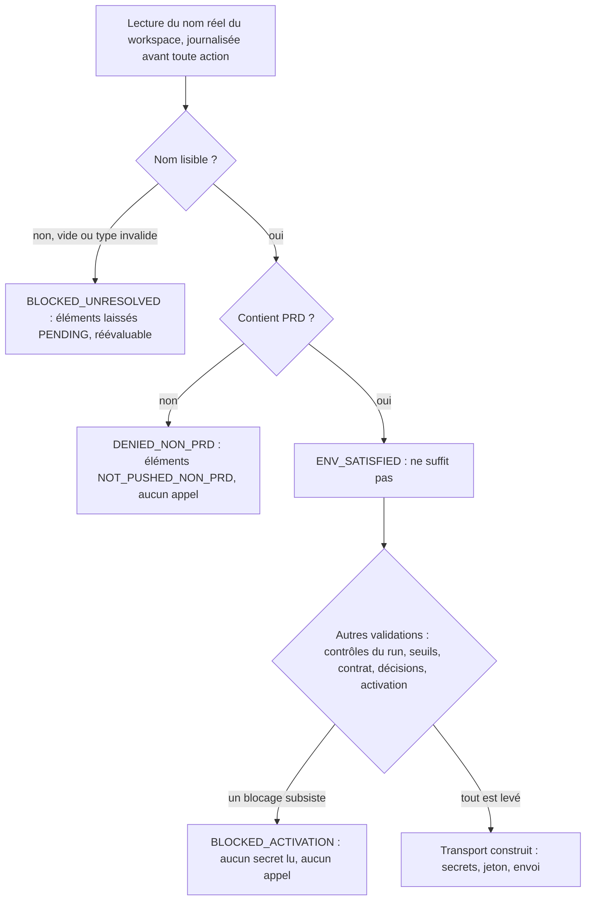
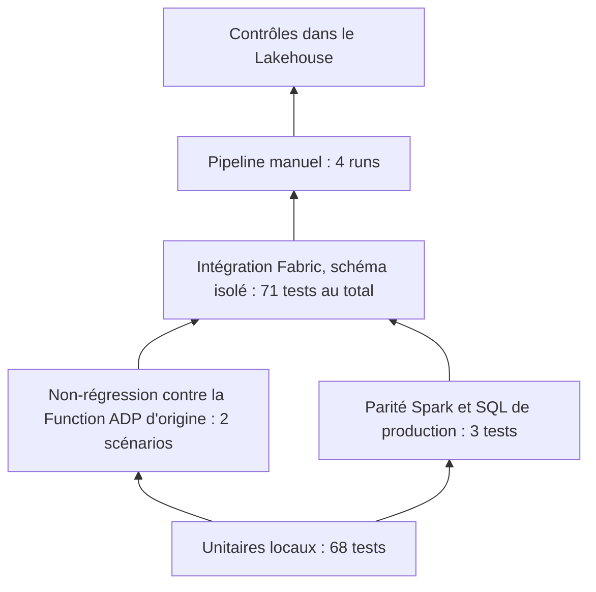

# Hub RH TalentSoft PRD → Lakehouse (puis ADP) sur Fabric — fonctionnement détaillé

Ce document détaille chaque point de la [vue d'ensemble](README.md). Il s'adresse aux personnes qui présentent,
développent, exploitent ou dépannent le hub. Les noms entre accents graves sont ceux des objets, tables, paramètres
et colonnes tels qu'ils apparaissent dans Fabric. Chaque affirmation indique, quand c'est utile, si elle a été
**vérifiée** (mesurée ou exécutée) ou si elle reste **non vérifiée**.

**Sommaire** — [Contexte](#contexte) · [Architecture](#architecture) · [Lancement](#lancement) ·
[Contrôle du run](#run-control) · [Acquisition](#acquisition) · [Transformation](#transformation) ·
[Comparaison](#comparaison) · [Promotion](#promotion) · [Publication ADP](#publication) · [Tables](#tables) ·
[Sécurité](#securite) · [Tests et preuves](#tests) · [Git et Fabric](#git) · [Exploitation](#exploitation) ·
[Démonstration](#demo) · [Blocages](#blocages) · [Questions probables](#faq) · [Glossaire](#glossaire)

---

<a id="contexte"></a>
## Contexte, objectifs et périmètre

**L'existant.** Une Function Python appelle l'API TalentSoft et dépose un JSON daté ; un pipeline Synapse exécute du
SQL serverless (delta J contre J-1, correspondances, rejets, format ADP) ; une seconde Function publie vers ADP ; des
Logic Apps envoient des courriels. Constats qui ont guidé la conception : l'appel ADP est inactif dans le pipeline
actuel, l'e-mail d'erreur n'était jamais envoyé, tout workspace non-DEV était traité comme la production.

**Ce que cette version apporte.**

| Sujet | Existant | Cette version |
|---|---|---|
| Orchestration | 5 pipelines Synapse, 2 Function Apps, 3 Logic Apps | 1 pipeline, 10 notebooks, 1 variable library |
| Échanges entre étapes | fichiers JSON, Parquet, CSV, drapeau de fin | tables Delta uniquement |
| Delta | J contre J-1 sur fichiers, absents non détectés | comparaison à la **référence du dernier run validé**, absents détectés |
| Reprise | relance complète | verrou, statut par étape, idempotence, outbox figée |
| Gestion d'erreur | notification exigeant 5 échecs simultanés | un gestionnaire d'erreur unique |
| Environnements | repli implicite vers la production | aucun repli ; source et destination séparées |
| Publication ADP | production en dur, aucune notion d'environnement | garde-fou, intention durable avant envoi, activation verrouillée |

**Périmètre de cette étape.** Valider la chaîne **TalentSoft PRD → Fabric non-PRD → Lakehouse**. Aucune publication
ni consultation d'ADP n'est requise ni effectuée. Le flux SFTP de rémunération, les notifications et l'import des
logs historiques sont hors périmètre.

**Source, exécution, destination.** Trois éléments sont volontairement séparés.

| Élément | Valeur | Qui la décide |
|---|---|---|
| Source | tenant TalentSoft **PRD** (`https://motul.talent-soft.com`) | constante du code, toute autre URL est refusée |
| Exécution | workspace `Sandbox - Fabric BI backend` (non-PRD) | workspace réel du notebook |
| Destination | Lakehouse `MOTUL_LH_HRIS` du même workspace | paramètre `lakehouse_name` de `VL_HRIS` |

<a id="architecture"></a>
## Architecture



**Les items.** Dix notebooks, une variable library et un pipeline sont créés dans le dossier de workspace
`TEST_MOTUL/TEST_2`. Le Lakehouse préexiste dans `TEST_MOTUL/TEST_1` ; il est réutilisé, non dupliqué (le nom
documenté `LH_HRIS` est remplacé par le Lakehouse désigné, `MOTUL_LH_HRIS`).

**Une bibliothèque, embarquée.** Le code métier vit dans une bibliothèque Python (`hris`, 17 modules de production).
Elle est copiée **à l'identique** dans chaque notebook, avec l'empreinte SHA-256 de chaque module vérifiée au
chargement. Raison : le support de `%run` en exécution par pipeline est documenté de façon contradictoire et n'a pas
été vérifié. `NB_HRIS_LIB` sert à la lecture et à l'usage interactif ; le pipeline ne l'appelle pas.

**Noms de tables à quatre parties.** Les tables sont adressées par `` `workspace`.`lakehouse`.schéma.table ``. Mesuré
dans ce workspace : sans Lakehouse par défaut attaché, les noms partiels (`ctl.run`) et à trois parties échouent
avec « please attach a lakehouse », alors que les noms à quatre parties fonctionnent pour toutes les opérations
utilisées (lecture, création, écriture avec `replaceWhere`, `MERGE`, mise à jour, suppression). Le nom du workspace est
lu dans le contexte réel du notebook ; le nom du Lakehouse vient de `VL_HRIS`. Conséquence : aucune dépendance à une
association de Lakehouse que la synchronisation Git pourrait ne pas conserver.

**Les schémas.**

| Schéma | Contenu | Écrit par |
|---|---|---|
| `cfg` | paramètres du processus, 17 tables de correspondance | `NB_HRIS_SETUP` (graine), correspondances à initialiser |
| `stg` | données du run : brut, source, enrichi, rejets, format paie | acquisition, transformation |
| `ref` | état validé du dernier run, un instantané par salarié | promotion uniquement |
| `pub` | outbox de publication, opérations, tentatives, réconciliations | promotion, publication |
| `ctl` | verrou, registre des runs, étapes | contrôle du run et tous les notebooks (étapes) |
| `log` | comparatifs, anomalies, rejets masqués, résumé, décisions du garde-fou, logs ADP | notebooks concernés |

Règle d'écriture : **un seul moteur** (Spark) écrit chaque table, par `replaceWhere run_id` ou `MERGE`, jamais par
suppression globale.

<a id="lancement"></a>
## Lancement et paramètres

**Déclenchement.** Manuel uniquement : interface Fabric ou API. Aucune planification n'existe (fréquence, quotas et
destinations non validés).

**Paramètres du pipeline `PL_HRIS_ORCHESTRATOR`.**

| Paramètre | Défaut | Rôle |
|---|---|---|
| `p_process_code` | `TS_ADP_EMPLOYEE` | seul processus actif (le flux SFTP de rémunération est bloqué) |
| `p_run_mode` | `NORMAL` | `NORMAL`, `INIT_REFERENCE` ou `RETRY_PUBLICATION` |
| `p_target_run_id` | vide | run à republier, réservé à `RETRY_PUBLICATION` |
| `p_business_date_override` | vide | tests uniquement ; refusé en `NORMAL` dans un workspace dont le nom contient `PRD` |

Aucun paramètre ne permet de forcer une publication.

**Les trois modes.**

| Mode | Quand | Effet |
|---|---|---|
| `INIT_REFERENCE` | premier chargement, référence vide | construit la référence ; **ni outbox, ni publication** ; refusé si la référence n'est pas vide |
| `NORMAL` | exploitation courante | compare, promeut, prépare l'outbox ; bloqué si la référence est vide (`REFERENCE_ABSENTE`) |
| `RETRY_PUBLICATION` | reprise après échec de publication | republie l'outbox d'un run déjà promu, **sans recalculer** le delta |

**Variables de `VL_HRIS`** (type String, aucune valeur secrète). Les valeurs sont transmises aux notebooks par le
pipeline.

| Variable | Valeur en DEV | Rôle |
|---|---|---|
| `env_code` | `DEV` | information (journaux) ; **jamais** utilisée par le garde-fou ADP |
| `ts_base_url` | `https://motul.talent-soft.com` | tenant TalentSoft PRD (seule valeur acceptée) |
| `kv_url_ts` | coffre `kvt-mge-azr-hris-ts-prd` | référence du coffre des identifiants TalentSoft |
| `kv_url_adp` | vide | référence du coffre ADP, vide hors PRD |
| `lakehouse_name` | `MOTUL_LH_HRIS` | Lakehouse cible |
| `business_timezone` | `Europe/Paris` | fuseau de la date métier (à confirmer) |
| `lock_lease_minutes` | `240` | durée du bail du verrou (à confirmer) |
| `adp_max_attempts` | `3` | tentatives maximales par opération (à confirmer) |
| `notification_recipients` | vide | aucune notification envoyée |

Les jeux de valeurs UAT et PRD ne sont **pas** créés : aucun déploiement hors DEV sans validation distincte.

<a id="run-control"></a>
## Contrôle du run — `NB_HRIS_RUN_CONTROL`

Trois actions, appelées par le pipeline.

**`START`.**

1. Contrôle des paramètres (mode, processus, bail, date) ; en `RETRY_PUBLICATION`, le run cible doit exister et avoir
   été promu.
2. **Date métier** : date de Paris du déclenchement ; rang du run dans la journée (`run_seq_in_day`).
3. **Verrou** `ctl.process_lock` : `MERGE` conditionnel puis relecture ; un conflit de concurrence Delta ou une
   relecture différente signifie « verrou non obtenu ». Le run se termine alors en `SKIPPED_CONCURRENT`, sans erreur
   et sans aucune écriture métier. Un bail expiré permet la reprise.
4. Enregistrement dans `ctl.run` (workspace réel, mode, date, déclencheur).

**`END`.** Calcule le statut final, écrit `log.run_summary` (volumes insérés, rejetés, lus, taux de rejet à quatre
décimales, compteurs de publication), libère le verrou et prépare le contenu d'une notification **sans donnée
personnelle**. L'envoi est bloqué (mécanisme et destinataires non décidés).

**`FAIL`.** Statut `FAILED`, message d'erreur assaini (aucune URL, adresse, identifiant ou nombre de plus de quatre
chiffres), libération du verrou.

**Statuts de `ctl.run`.**



Statut final : `PROMOTED` ou `PUBLISHED` donne `SUCCEEDED` ; `BLOCKED`, `FAILED`, `NOT_PUBLISHED_NON_PRD` et
`PUBLISHED_PARTIAL` sont conservés ; un run arrêté en cours de séquence est `FAILED`.

**Politique des activités du pipeline** (toutes en `retry = 0`, sans exception).

| Activité | Notebook | Délai maximal | Condition de démarrage |
|---|---|---|---|
| `RunStart` | contrôle, `START` | 20 min | — |
| `Acquire` | acquisition | 3 h | `RunStart` OK et `status = OK` |
| `Transform` | transformation | 1 h | `Acquire` réussie |
| `Compare` | comparaison | 30 min | `Transform` réussie |
| `Promote` | promotion | 30 min | `Compare` réussie |
| `Publish` | publication | 4 h | `Promote` réussie |
| `RunEnd` | contrôle, `END` | 20 min | `Publish` réussie |
| `RunFail` | contrôle, `FAIL` | 20 min | `Publish` **échouée ou sautée** : capte l'échec de n'importe quelle étape amont |

Vérifié dans Fabric : la branche `IfStarted` s'exécute sur la valeur de sortie de `RunStart` ; les paramètres issus de
`VL_HRIS` parviennent aux notebooks ; `RunFail` s'exécute quand `Acquire` échoue. Aucun retry de niveau supérieur ne
peut relancer implicitement la publication.

<a id="acquisition"></a>
## Acquisition TalentSoft PRD — `NB_HRIS_TS_ACQUIRE`

**Reprise fidèle de la Function existante** (règles R-TS de la spécification A01), avec quelques améliorations
techniques.

**Authentification.** OAuth2 `client_credentials` sur `POST /api/token`, sans scope. Les deux secrets sont lus par
`notebookutils.credentials.getSecret` à l'exécution ; ils sont encapsulés (jamais affichés, jamais en paramètre).

**Étapes.**

1. Lecture de `totalCount` (`directory/employees?count=1`), puis de la liste complète en **une seule page**
   (`count=totalCount`). Il n'y a pas de pagination ni de filtre de période : l'extraction est **complète à chaque
   run**.
2. **Filtre « Motul France »** : pour chaque salarié, la situation la plus récente donne un code de poste, puis le
   poste à cette date donne `LegalStructure` ; seuls les salariés dont la valeur vaut exactement `Motul France` sont
   retenus.
3. **Détail** : 16 entités `hub/v2` par salarié (situation, dates clés, identités, contrat, coordonnées, banque,
   rémunération…) plus le poste et l'adresse postale.
4. **Règles de valeur** : valeur courante déterminée dans l'ordre de l'API par la date de début maximale ; valeurs
   « falsy » converties en chaîne vide ; montants de rémunération conservés tels quels ; date de fin de contrat à
   `1900-01-01` si absente ; `Hors_France` selon le pays ; pourcentage d'imputation sans le signe `%`.

**Concurrence et robustesse.**

| Sujet | Règle |
|---|---|
| Parallélisme | 5 requêtes simultanées par hôte, 2 salariés en parallèle, lots de 75, pause de 2 s entre lots |
| Reprises | 429, 503 et erreurs réseau : jusqu'à 3 essais (2 pour situation et poste), attente doublée à chaque essai |
| `Retry-After` | respecté, plafonné à 60 s (amélioration) |
| Disjoncteur | 5 échecs réseau → requêtes ignorées pendant 60 s |
| Jeton | renouvelé à chaque lot et sur `401` (lecture seulement) |
| Redirections | jamais suivies |
| Délais | connexion 30 s, lecture 60 s |

**Contrôles de complétude** (écrits dans `log.anomaly`, bloquants sauf mention). Une extraction partielle n'est jamais
présentée comme complète : `EXTRACTION_INCOMPLETE` (reçus différent de `totalCount`), `EMPTY_EXTRACTION`,
`SCHEMA_CHANGE`, `TS_FILTER_TECHNICAL_FAILURE` (filtre indécidable), `TS_ENDPOINT_FAILURE` (appels de détail en échec
après reprises), `TS_PROCESSING_ERROR`, `TS_CIRCUIT_OPEN`, `TS_SECRET_RESOLUTION`. Les réponses `404` donnent un
avertissement (`TS_FILTER_NOT_FOUND`, `TS_ENDPOINT_NOT_FOUND`). Les échecs de l'existant étaient silencieux ; ils sont
désormais comptés.

**Minimisation.** Seules les **70 clés** lues en aval sont conservées dans `stg.ts_employee_raw` ; les données de santé
(handicap, accident du travail, visite médicale) et les champs inutilisés ne sont pas persistés.

**Traçabilité.** L'étape `ACQUIRE` de `ctl.run_step` consigne, sans valeur personnelle : la **source** (`TS_PRD_API`),
le périmètre, le nombre de lignes persistées, le nombre de clés distinctes, les compteurs et l'état de chaque
endpoint. Les jeux fictifs portent `source = FIXTURE` et ne s'écrivent que dans le schéma de test.

**Pré-contrôle** (`p_preflight_only = true`) : vérifie la source (PRD), la résolution des secrets, la joignabilité TCP
du tenant et la destination, **sans appeler l'API**. Résultat constaté en DEV : source valide, réseau joignable,
destination résolue, **secrets non résolus**.

**Le blocage constaté.** `getSecret` échoue avec `401 AKV10032: Invalid issuer`. Le workspace d'exécution appartient
au tenant SBI ; le Key Vault qui porte les identifiants TalentSoft PRD appartient au tenant Motul ; le jeton émis par
le premier n'est pas accepté par le second. Il n'a été ni contourné, ni résolu par copie de secret. Voir
[Blocages](#blocages).

<a id="transformation"></a>
## Transformation — `NB_HRIS_TRANSFORM`

**Principe : parité.** Le SQL de production extrait de `Pipeline INIT` (cinq procédures) est reproduit à
l'identique, **bugs compris**. Toute correction est un changement fonctionnel à faire valider.



1. **Parsing** (`stg.ts_employee_source`) : 69 colonnes, toutes tronquées à 50 caractères comme `NVARCHAR(50)` ; le
   téléphone professionnel prend le mobile **sauf s'il est nul** (une chaîne vide ne bascule pas sur le fixe) ; la valeur
   `None` de la date de fin de contrat devient vide.
2. **Contrôle des correspondances** (bloquant) : table absente, colonnes manquantes, table **vide**, clé en double.
   Dans ce cas seul l'enrichissement est interrompu ; le parsing reste écrit, et aucun rejet massif trompeur n'est
   produit.
3. **Enrichissement** : 15 jointures à gauche sur 13 tables de correspondance (les 4 autres sont chargées mais non
   utilisées), espaces de fin ignorés comme SQL Server. Une correspondance dupliquée **duplique** le salarié (comportement
   conservé, signalé par un contrôle).
4. **Rejets**, trois familles : `Null_Rejet` (matricule de paie, matricule IT ou numéro de sécurité sociale vides),
   `Format_Rejet` (18 contrôles : longueur du matricule, 13 dates, pourcentages, montant de prime), `Référence_Rejet`
   (15 correspondances introuvables). Un salarié qui porte au moins un rejet est **exclu** du résultat.
5. **Format paie** (`stg.ts_employee_adp`) : 72 colonnes dans l'ordre d'origine ; dates converties ;
   `mt_salaire_mensuel = salaire de base arrondi au centime ÷ 12` en `DECIMAL(23,13)` ; `row_hash` calculé.

**Émulation de T-SQL en Spark.**

| Sujet | T-SQL | Reproduction |
|---|---|---|
| `ISDATE` | permissif, dépend de la langue | 5 formats numériques, année ≥ 1753 (mesuré à l'identique de la référence Python) |
| `ISNUMERIC` / `CAST(... AS NUMERIC(12,2))` | accepte `$`, `1e5`… puis le `CAST` peut échouer | même grammaire ; un `CAST` impossible fait échouer le run, comme l'existant |
| `CONVERT(DATE, '')` | `1900-01-01` | reproduit ; `NULL` reste `NULL` |
| Espaces de fin | ignorés par `=` et `LEN` | `rtrim` des deux côtés |
| `NULL` et chaîne vide | traités différemment | reproduit (un `NULL` n'est pas un rejet d'information obligatoire) |
| Division | `DECIMAL(23,13)` | le diviseur est converti en `DECIMAL(10,0)` : en Spark 3.5, `decimal(12,2) / 12` donnait `DECIMAL(16,6)` |

**Particularités de l'existant conservées**, à valider par le métier : un ETP hors bornes seul ne provoque aucun rejet
(il n'entre pas dans la somme) ; le pays fiscal n'est jamais contrôlé ; le contrôle de classification est commenté ;
une valeur vide de salaire fait échouer le run.

**Empreinte `row_hash`.** `sha2` des **71 colonnes métier** (hors date de transformation), séparées par un caractère
de contrôle, `NULL` remplacé par un marqueur : elle distingue `NULL` et chaîne vide.

**Masquage.** `log.reject` remplace par `***` les valeurs sensibles (date de naissance, numéro de sécurité sociale,
coordonnées bancaires) ; les rejets complets, avec valeurs, restent dans la table protégée `stg.ts_employee_reject`.

<a id="comparaison"></a>
## Comparaison — `NB_HRIS_COMPARE`

La clé est `id_unique` (à confirmer), la référence est `ref.ts_employee_adp` (état du dernier run validé).

| Catégorie | Définition | Conséquence |
|---|---|---|
| `NEW` | clé absente de la référence | à publier ; insérée en référence |
| `MODIFIED` | clé présente, `row_hash` différent | à publier ; mise à jour ; **noms** des colonnes modifiées journalisés |
| `UNCHANGED` | `row_hash` identique | rien |
| `ABSENT` | dans la référence, absente de l'extraction | journalisée ; **supprimée** de la référence ; non publiée |
| `REJECTED` | clé extraite mais rejetée | référence **inchangée** : sera retraitée |

**Journaux.** `log.comparison_summary` (compteurs et pourcentages), `log.comparison_detail` (clé, catégorie, **noms**
de colonnes, empreintes ; jamais de valeurs), `log.anomaly`.

**Contrôles et décision.**

| Contrôle | Gravité | Sens |
|---|---|---|
| `STAGING_MISSING` | bloquant | aucune transformation aboutie pour ce run |
| `NULL_KEY`, `DUPLICATE_KEY` | bloquant | clé manquante ou en double |
| `REFERENCE_ABSENTE` | bloquant en `NORMAL` | référence vide : faire d'abord `INIT_REFERENCE` |
| `REFERENCE_NOT_EMPTY` | bloquant en `INIT_REFERENCE` | pas de réinitialisation d'une référence existante |
| `ABSENT_RATIO`, `MODIFIED_RATIO`, `REJECT_RATIO` | **`NOT_CONFIGURED`** | seuils non fournis : calculés et journalisés, aucun seuil inventé |

Le run est `VALIDATED` si aucune anomalie bloquante n'a échoué, sinon `BLOCKED`. **Recalcul interdit** dès qu'une
écriture de promotion existe pour le run : une reprise ne recalcule jamais le delta contre une référence déjà promue.

<a id="promotion"></a>
## Promotion — `NB_HRIS_PROMOTE`

1. Le run doit être `VALIDATED` ; les contrôles bloquants et les **seuils** sont **revalidés avec la configuration
   courante** (un seuil renseigné entre-temps peut bloquer).
2. La référence ne doit pas avoir été déplacée par un autre run depuis la comparaison (`REFERENCE_MOVED`).
3. Un marqueur d'étape est écrit avant la première écriture ; l'outbox `pub.adp_outbox` est créée (statut `PENDING`)
   pour les clés `NEW` et `MODIFIED`, sauf en `INIT_REFERENCE`.
4. **Un seul `MERGE`** sur `ref.ts_employee_adp` : mise à jour si l'empreinte diffère, insertion, suppression des
   absents, conservation des clés rejetées.
5. `ctl.run.promoted_at_utc` est écrit **une seule fois** : rejouer la promotion d'un run déjà promu ne fait rien (une
   ancienne promotion ne peut pas ramener la référence en arrière).

Pas de transaction entre plusieurs tables : la cohérence repose sur ces garde-fous et sur l'idempotence, non sur une
atomicité globale.

<a id="publication"></a>
## Publication ADP — `NB_HRIS_PUBLISH_ADP`

**Rappel de portée.** Aucun envoi réel n'est possible dans cette version. Tout ce qui suit est implémenté et testé
avec des clients fictifs.

### La condition d'environnement

La règle, inchangée : la condition est satisfaite **si et seulement si** le nom *réel* du workspace d'exécution du
notebook de publication **contient la sous-chaîne `PRD`**, sensible à la casse. Le nom est lu dans le contexte du notebook
lui-même, jamais par un paramètre, une branche, un dossier ou le workspace du pipeline.



Trois issues **distinctes** : nom connu sans `PRD` (absence normale de publication), nom non résolu (blocage
réévaluable, jamais classé définitivement), nom contenant `PRD` (condition satisfaite mais **jamais suffisante**).
Dans cette version, `ADP_ACTIVATION_APPROVED` vaut `False` dans le code : même un workspace dont le nom contient
`PRD` ne déclenche aucun appel. Aucun paramètre, aucune variable ni aucun simulateur ne peut le lever.

Effets de la règle littérale, **à faire trancher avant toute activation** : `PREPRD` et `NOTPRD` satisfont la
condition ; `prd` en minuscules ne la satisfait pas ; une exécution interactive dans le workspace PRD publie aussi.

### Intention durable et identité

Une **opération** est un événement métier ADP (un `POST`) pour un salarié ; ses **tentatives** sont distinctes
(`pub.adp_operation`, `pub.adp_attempt`). Le portage reproduit les 16 familles de la Function d'origine : embauche
(`P1`), huit mises à jour de personne et de contact (`P2` à `P7`, `P9`), et les événements d'affectation `P8` éclatés
en variantes (`P8_SALARY`, `P8_BONUS`, `P8_CONTRACT_A`, `P8_CONTRACT_B`, `P8_END_DATE`, `P8_SCHEDULE`, `P8_ORG`,
`P8_IMPUTATION`, `P8_SENIORITY`, `P8_POSITION`).

- **Avant tout envoi**, l'intention est écrite durablement (`INTENT_RECORDED`). Si cette écriture échoue, **rien n'est
  envoyé**.
- **Identité stable** : empreinte du run source, du salarié, de la variante et de la valeur cible. Le même événement
  rejoué garde la même identité ; une nouvelle modification légitime, **même un retour à une valeur déjà vue**, en a
  une autre. Il n'y a pas de déduplication à vie sur le couple salarié et code d'opération.
- **Dépendances** : une opération dépend d'autres du même salarié (la date de fin de contrat dépend du contrat) ; si la
  précédente n'est pas acceptée, la suivante passe en `BLOCKED_DEPENDENCY`.

### Transport et résultats

| Classe | Définition | Suite |
|---|---|---|
| `NOT_TRANSMITTED` | échec **avant** l'émission du premier octet (DNS, TCP, TLS) | renvoi possible par reprise explicite |
| `ACCEPTED` | accepté selon le contrat de l'endpoint | statut `SENT` : accepté, **pas** nécessairement appliqué |
| `REJECTED` | rejet confirmé (400, 403, 404, 409, 429, 401…) | reprise explicite après correction |
| `UNCERTAIN` | délai après émission, coupure, 3xx, 5xx, 2xx inattendu ou inexploitable | **aucun renvoi automatique** ; réconciliation ou décision tracée |

Règles : aucun retry automatique (y compris dans les bibliothèques), aucun renvoi implicite après `401` (les envois
du run s'arrêtent), aucune redirection suivie, délais explicites. La non-transmission n'est **jamais** déduite du
seul nom d'une exception. Une réponse `2xx` ne suffit pas : le corps doit être exploitable. **Les listes de statuts
sont provisoires** (le contrat final est absent) : utilisables en simulation, pas pour autoriser un envoi réel.

### Réconciliation, obsolescence, décisions manuelles

- **Réconciliation** : un état lu chez ADP qui égale **tous** les champs cibles donne `APPLIED_OBSERVED` ; une lecture
  partielle ne conclut rien ; un état différent **ne prouve pas** le non-traitement et exige une décision manuelle.
- **Obsolescence** (`SUPERSEDED`) : un élément ancien non envoyé n'est couvert que par un élément plus récent du même
  salarié portant l'état complet **et** si aucune de ses opérations n'est incertaine. Une modification ancienne non
  envoyée n'est pas perdue par un run plus récent.
- **Décisions manuelles** : `AUTHORIZE_RESEND`, `MARK_APPLIED`, `ABANDON` ; auteur et fondement **obligatoires**,
  tracés dans `log.adp_manual_decision`.

### Preuve de la non-publication

1. **Journal du garde-fou** (`log.adp_gate_decision`) écrit avant toute action.
2. **Comptage applicatif** : la fabrique du transport (qui lirait les secrets ADP) est appelée zéro fois ; un contrôle
   **positif** en contexte simulé autorisé prouve que le comptage détecte bien un appel.
3. **Sentinelle réseau** : pendant toute la publication, toute résolution DNS ou connexion vers `*.adp.com` ou
   `geo.api.gouv.fr` est interceptée, **enregistrée et bloquée** ; le nombre de tentatives est tracé.
4. **Aucune ligne** dans `pub.adp_operation` ni `pub.adp_attempt` pour le run.

*Limites* : la preuve est **applicative** (processus du driver). Elle n'exclut pas un trafic émis hors de ce processus,
et aucune observation réseau externe (pare-feu, journaux d'audit du coffre) n'était disponible.

### Le contrat final, point par point

Le contrat final de publication et de reprise n'a pas été fourni. Chaque endroit du code qui en dépend porte un
marqueur `CONTRAT-ADP:Cxx` (17 points, C00 à C16) recensé dans un document dédié : identité d'un événement, statuts
acceptés, rejets, incertitude, `401`, `429`, réconciliation, dépendances, obsolescence, décisions manuelles, états,
variantes, reprise, politique des lectures, idempotence côté ADP, sens de `SENT`. Un test vérifie que le code et le
document restent cohérents. **C00 (le verrou d'activation) se lève en dernier.**

<a id="tables"></a>
## Les 42 tables du Lakehouse

| Schéma | Tables | Écrite par | Données personnelles |
|---|---|---|---|
| `cfg` (18) | `process`, 17 `lu_hr_*` | setup (graine) ; correspondances à initialiser | non |
| `stg` (5) | `ts_employee_raw`, `_source`, `_enriched`, `_reject`, `_adp` | acquisition, transformation | **oui** |
| `ref` (1) | `ts_employee_adp` | promotion | **oui** |
| `pub` (4) | `adp_outbox`, `adp_operation`, `adp_attempt`, `adp_reconciliation` | promotion, publication | outbox et opérations : oui |
| `ctl` (3) | `process_lock`, `run`, `run_step` | contrôle du run, tous | non |
| `log` (11) | `comparison_summary`, `comparison_detail`, `anomaly`, `reject`, `run_summary`, `adp_gate_decision`, `adp_publication_log`, `adp_manual_decision`, `log_file_import`, `log_file_import_reject`, `notification` | notebooks concernés | détail, rejets, log ADP : oui |

Les quatre tables de publication par opération (`adp_operation`, `adp_attempt`, `adp_reconciliation`,
`adp_manual_decision`) sont des **propositions** : leur sémantique dépend du contrat final.

**Correspondances.** Les 17 tables sont créées **vides** : leur contenu, aujourd'hui maintenu sur le SFTP TalentSoft,
n'est pas disponible. Aucune correspondance n'est inventée. 13 sont utilisées par la transformation ; `diplome`,
`work_accident`, `convention_collective` et `contrat` (version 1) sont créées mais non utilisées.

**Colonnes techniques.** `run_id` et `business_date` sur toutes les tables de run ; `_extracted_at_utc` ; `row_hash` ;
`_last_run_id` et `_validated_at_utc` sur la référence.

<a id="securite"></a>
## Sécurité et confidentialité

- **Secrets** : lus à l'exécution, encapsulés (représentation `SecretValue(***)`), jamais en paramètre, en variable de
  pipeline, en table, en fichier ni en sortie. Aucun motif de secret n'a été trouvé en balayant le code et le dossier Git.
- **Assainissement** : tout message écrit dans une table masque les URL, adresses, IBAN, jetons et toute suite de quatre
  chiffres ou plus ; les compteurs construits par le code sont conservés.
- **Sorties de notebooks** : JSON court, compteurs uniquement ; aucune donnée RH.
- **Tables sensibles** : onze tables contiennent des données personnelles ; elles doivent rester en accès restreint.
- **Protections et audience constatées** du workspace de destination : rôles portés par deux groupes (administrateurs
  Fabric, contributeurs du sandbox) et l'utilisateur ; **sécurité par rôles OneLake désactivée** sur ce Lakehouse. Les
  administrateurs, membres et contributeurs voient toutes les données du workspace. L'écriture de données RH réelles
  dans ce sandbox a fait l'objet d'une confirmation explicite de l'utilisateur ; elle n'a pas eu lieu.
- **Constat à transmettre à la sécurité** : le coffre DEV du projet contient aussi les secrets ADP, contrairement à la
  documentation qui les réservait à la production.
- **Pas de copie ailleurs** : aucun secret, aucune donnée RH n'a été copié vers un autre emplacement.

<a id="tests"></a>
## Tests et preuves



| Niveau | Contenu | Résultat |
|---|---|---|
| Unitaires locaux | parité T-SQL et règles, acquisition (faux serveur), publication (clients fictifs), import de logs, noms de tables, pipeline, marqueurs de contrat | **68 réussis** |
| Non-régression NR-03 | la Function ADP d'origine (fichier non modifié) et le portage exécutés localement contre le **même simulateur** : même séquence de requêtes d'écriture, mêmes corps JSON, mêmes lignes de log ; scénarios nominal et erreurs HTTP | **2 réussis** |
| Parité Spark | la transformation Spark égale l'implémentation de référence du SQL sur des cas limites | **3 réussis** (locaux, repris dans la campagne Fabric) |
| Prototype d'origine | 10 tests du garde-fou initial, conservé intact | **10 réussis** |
| Fabric, données fictives | schéma isolé `hris_tst`, contexte réel du workspace | campagne 1 : 65 tests, 1 erreur de test corrigée ; campagne 2 : 66, 0 échec ; **campagne 3 : 71, 0 échec**, sans Lakehouse par défaut ; 1 test ignoré dans Fabric (cohérence des marqueurs, vérifiée en local) |
| Analyse statique | syntaxe de 49 fichiers ; noms indéfinis des 10 notebooks (avec un contrôle positif) | **0 problème** |
| Sondes de plateforme | deux notebooks de sonde, sans Lakehouse par défaut | noms partiels et à 3 parties en échec ; 4 parties opérationnels |

**Scénarios d'intégration Fabric** : verrou et concurrence (deux acquisitions simultanées, une seule réussit, bail
expiré) ; premier chargement bloqué puis `INIT_REFERENCE` puis run courant avec outbox et garde-fou réel ; refus d'un
`INIT_REFERENCE` sur référence non vide ; lot vide ; revalidation après renseignement d'un seuil ; correspondance
manquante qui n'interrompt que l'enrichissement ; libération du verrou en fin de run.

**Scénarios de publication** (clients fictifs) : tous les noms de workspace, y compris `PREPRD`, `NOTPRD`, `prd` ;
intention durable avant envoi ; plantage avant, pendant et après l'envoi ; `2xx` inexploitable, `401`, `429`, `5xx`,
délai, redirection ; absence de retry et de renvoi ; dépendances ; deux modifications légitimes successives du même
champ ; obsolescence sans perte ; réconciliation ; décisions manuelles.

**Ce qui n'est pas prouvé.** Aucune extraction réelle, donc aucun contrôle de parité sur des données réelles (les écarts
`ISDATE` et `ISNUMERIC` ne sont pas mesurés) ; aucune publication ; le comportement du lien Lakehouse après une
synchronisation Git n'est pas vérifiable sans commit.

<a id="git"></a>
## Intégration Git et Fabric

**Dépôt et association.** Dépôt GitHub `thourak/studious-system`, branche `main`, **répertoire `/`**, associé au
workspace. Les items HRIS sont dans `TEST_MOTUL/TEST_2` ; le Lakehouse reste dans `TEST_MOTUL/TEST_1`.

**Format natif.** Un dossier par item : `<Nom>.Notebook/` (`notebook-content.py` et `.platform`),
`<Nom>.DataPipeline/` (`pipeline-content.json` et `.platform`), `<Nom>.VariableLibrary/` (fichiers de définition). Le
contenu des fichiers est l'**export du service Fabric**, pas une reconstitution : les cellules de code sont comparées à
celles déployées, et le dossier est contrôlé (références, noms, absence de marqueur non résolu, `retry = 0`).

**Identifiants.** Chaque item a un identifiant réel (propre au workspace) et un identifiant **logique** (celui de Git).
Les 12 items sont créés mais non commités : leur identifiant logique n'existe pas encore. Ceux des fichiers préparés
sont **prédits** d'après une règle observée sur les 4 items déjà validés depuis ce workspace (permutation déterministe
de l'identifiant réel) ; ce sont des prédictions que Fabric confirmera au commit. Les références du pipeline vers les
notebooks utilisent ces identifiants logiques, avec un identifiant de workspace nul (même workspace), comme les pipelines
déjà synchronisés.

**Contenu du dossier** : `VL_HRIS`, neuf notebooks (dont `NB_HRIS_PUBLISH_ADP` pour son garde-fou, référencé par le
pipeline) et le pipeline. Exclus : l'import des logs historiques (non requis, import réel interdit), les
notifications, un Environment (inutile), un second Lakehouse.

**État constaté.** Aucun commit ni push n'a eu lieu. La branche distante est en avance sur le workspace ; 390 éléments du
sandbox sont non commités, donc un « tout valider » depuis Fabric serait faux.

| Voie | Opérations | Point d'attention |
|---|---|---|
| **A, recommandée** | commit sélectif des seuls 12 items depuis Fabric | Fabric attribue les identifiants logiques ; la mise à jour préalable avec la branche distante est peut-être exigée |
| **B** | commit et push des fichiers préparés, puis mise à jour depuis Git | les items homonymes existent déjà dans le workspace : le comportement de Fabric (rapprochement ou collision) **n'est pas vérifié** |

<a id="exploitation"></a>
## Exploitation : relancer, vérifier, reprendre

**Relancer.** Pipeline `PL_HRIS_ORCHESTRATOR`, premier run en `INIT_REFERENCE`, les suivants en `NORMAL` ; ou par
l'API. Un run réel exige préalablement : l'accès aux secrets (blocage), un pré-contrôle réussi, le contenu des
correspondances.

**Durées observées** : démarrage d'une session Spark de quelques minutes par notebook ; un run qui échoue à l'acquisition
dure de 12 à 15 minutes (3 runs mesurés). Ne pas lancer deux gros jobs en
parallèle : le pool de démarrage est limité (un démarrage de run a expiré en file d'attente).

**Vérifier un run dans le Lakehouse.** L'outil `verify_lakehouse.py` produit, pour un `run_id`, un verdict par contrôle,
sans afficher de valeur RH :

| Contrôle | Vérifie |
|---|---|
| C01-C02 | workspace non-PRD, Lakehouse à schémas |
| C03-C04 | run unique dans `ctl.run`, exécuté dans le workspace cible |
| C05-C06 | acquisition aboutie, **source = `TS_PRD_API` et non `FIXTURE`** |
| C07 | volume persisté (compté par `run_id`) égal au volume tracé |
| C08 | complétude : reçus égal à `totalCount` |
| C09 | lignes égales aux clés distinctes (dédoublonnage) |
| C10 | aucune anomalie bloquante |
| C11 | colonnes conformes au DDL |
| C12 | aucune opération ni tentative ADP, aucun transport construit |

Le contrôle ne se contente jamais de constater « la table contient des lignes » : chaque volume est corrélé au `run_id`,
à son enregistrement dans `ctl.run` et à la source tracée, ce qui écarte les lignes d'un ancien run ou d'un test.

Équivalent SQL (point de terminaison SQL du Lakehouse), en remplaçant `<run_id>` :

```sql
SELECT run_id, run_mode, status, workspace_name, business_date, error_code FROM ctl.run WHERE run_id = '<run_id>';
SELECT step_code, attempt_no, status, rows_out, message FROM ctl.run_step WHERE run_id = '<run_id>' ORDER BY started_at_utc;
SELECT COUNT(*) AS lignes, COUNT(DISTINCT employeeNumber) AS cles FROM stg.ts_employee_raw WHERE run_id = '<run_id>';
SELECT control_code, severity, outcome, metric_value, message FROM log.anomaly WHERE run_id = '<run_id>' ORDER BY control_code;
SELECT COUNT(*) FROM pub.adp_operation WHERE run_id = '<run_id>';
SELECT decision, reason_code FROM log.adp_gate_decision WHERE run_id = '<run_id>';
```

**Reprendre.** Run en échec avant promotion : relancer ; la référence est restée intacte. Run bloqué : corriger la cause
puis relancer, **jamais de promotion forcée** sans décision tracée. Publication partielle : `RETRY_PUBLICATION` avec
`p_target_run_id`. Verrou orphelin : attendre l'expiration du bail ; ne jamais supprimer la ligne de verrou.

**Retour arrière, sans perte de données.** Redéployer la version précédente du code ; ne supprimer aucune table ;
restaurer la référence par `RESTORE` seulement avec validation distincte (journal Delta de 30 jours).

<a id="demo"></a>
## Parcours de démonstration (15 minutes, dans le plan)

| # | Montrer | Message |
|---|---|---|
| 1 | Le dossier `TEST_2` dans le workspace : notebooks, pipeline, variable library | les objets existent, ce n'est pas qu'un catalogue |
| 2 | `VL_HRIS` : variables et absence de secret | séparation source, exécution, destination |
| 3 | Historique d'un run du pipeline : vue des activités du run en échec contrôlé | l'enchaînement, la gestion d'échec unique, le motif réel |
| 4 | `ctl.run`, `ctl.run_step`, `log.anomaly` pour ce run | le blocage est **tracé** (`TS_SECRET_RESOLUTION`), pas caché |
| 5 | Résultat du contrôle de Lakehouse sur ce run puis sur un run fictif | les contrôles distinguent réel et fixture, et ne mentent pas |
| 6 | Le run fictif complet : référence, outbox, décision du garde-fou | `DENIED_NON_PRD`, zéro transport, zéro tentative réseau |
| 7 | Les deux sondes de plateforme | pourquoi les noms de tables sont à quatre parties |
| 8 | Le diff Git préparé et la note de synchronisation | ce qui reste à autoriser |

<a id="blocages"></a>
## Blocages, décisions et prochaines étapes

| Réf. | Blocage | Constat | Action précise |
|---|---|---|---|
| B-01 | Secrets TalentSoft PRD inaccessibles | `AKV10032 Invalid issuer` : coffre d'un autre tenant | fournir un workspace DEV dans le tenant Motul **ou** valider un accès inter-tenant ; aucune copie de secret |
| B-02 | Correspondances vides | 17 tables créées vides | fournir le contenu validé des 13 tables utilisées ou une procédure d'initialisation approuvée |
| B-03 | Contrat final de publication absent | 17 points d'usage recensés | fournir le contrat ; appliquer point par point ; lever C00 en dernier |
| B-04 | Notifications | mécanisme et destinataires non décidés | décider ; aucun envoi à ce jour |
| G-01 | Synchronisation Git | rien commité ; voies A et B | choisir la voie ; l'autorisation de commit et push est à donner |

**Décisions à rendre avant toute activation d'ADP** (hors périmètre de cette étape) : convention de nommage des
workspaces (`PREPRD`, `NOTPRD`, `prd`), identité d'exécution, seuils d'anomalie, isolement des erreurs par salarié et
traitement d'une erreur d'existence ADP, liste blanche d'adresses IP chez ADP, politique des lectures ADP.

**Valeurs par défaut appliquées, non validées** : clé `id_unique`, 71 colonnes comparées, comparaison sur données finales,
absents supprimés de la référence, rejetés conservés, fuseau de Paris, bail de 240 minutes, trois tentatives maximales.

**Prochaines étapes, dans l'ordre.**

1. Lever B-01 (nouvelle cible ou accès validé) puis relancer le pré-contrôle.
2. Premier run réel en `INIT_REFERENCE` ; contrôle `verify_lakehouse` ; revue des volumes avec le métier.
3. Lever B-02 puis valider la transformation sur données réelles (mesure des écarts de parité).
4. Choisir la voie Git et synchroniser.
5. Pipeline de déploiement vers UAT et PRD, après validation distincte.
6. Contrat ADP puis checklist d'activation, **indépendamment** du reste.

<a id="faq"></a>
## Questions probables

**Pourquoi ne pas utiliser un tenant TalentSoft de test depuis le workspace non-PRD ?** La source réelle est la
production dans tous les environnements : un repli silencieux masquerait un échec et ferait valider des données
fictives. Le code refuse toute autre URL.

**Pourquoi un workspace non-PRD peut-il lire la production ?** La lecture de TalentSoft est autorisée ; ce qui est
verrouillé est la publication vers ADP.

**Que se passe-t-il si ADP répond par une erreur serveur ?** L'opération devient incertaine ; elle n'est jamais renvoyée
automatiquement. Une lecture ADP peut conclure à l'application, mais un état différent ne prouve pas le non-traitement :
une personne tranche et sa décision est tracée.

**Pourquoi un nom de workspace par sous-chaîne sensible à la casse ?** C'est la règle demandée, conservée telle quelle ;
ses effets de bord (`PREPRD`, `prd`) sont documentés et à trancher avant activation.

**Pourquoi la bibliothèque est-elle copiée dans chaque notebook ?** Pour ne pas dépendre de `%run`, dont le support en
exécution par pipeline n'est pas vérifié ; l'intégrité est garantie par empreinte.

**Peut-on démontrer que rien n'a été envoyé à ADP ?** Applicativement oui (garde-fou journalisé, transport jamais
construit, sentinelle réseau, aucune opération) ; une preuve réseau externe n'était pas disponible.

**Les données de santé sont-elles conservées ?** Non : elles sont lues pour parité de l'appel puis jamais persistées.

**Et si deux runs démarrent ensemble ?** Le second obtient `SKIPPED_CONCURRENT` et n'écrit rien (testé avec deux
acquisitions simultanées).

<a id="glossaire"></a>
## Glossaire

| Terme | Sens |
|---|---|
| Run | une exécution du pipeline, identifiée par l'identifiant d'exécution Fabric |
| Référence | état validé du dernier run, un instantané par salarié (ni cumulatif ni historisé) |
| Outbox | liste figée des salariés à publier, créée à la promotion |
| Opération | événement métier ADP pour un salarié ; elle a des tentatives |
| Garde-fou | contrôle du nom réel du workspace d'exécution du notebook de publication |
| Parité | reproduction fidèle du comportement de l'existant, bugs compris |
| Fixture | jeu de données fictif, réservé aux tests isolés |
| `logicalId` | identifiant d'un item dans Git ; distinct de l'identifiant réel dans le workspace |
| Quatre parties | nom de table complet : workspace, Lakehouse, schéma, table |
